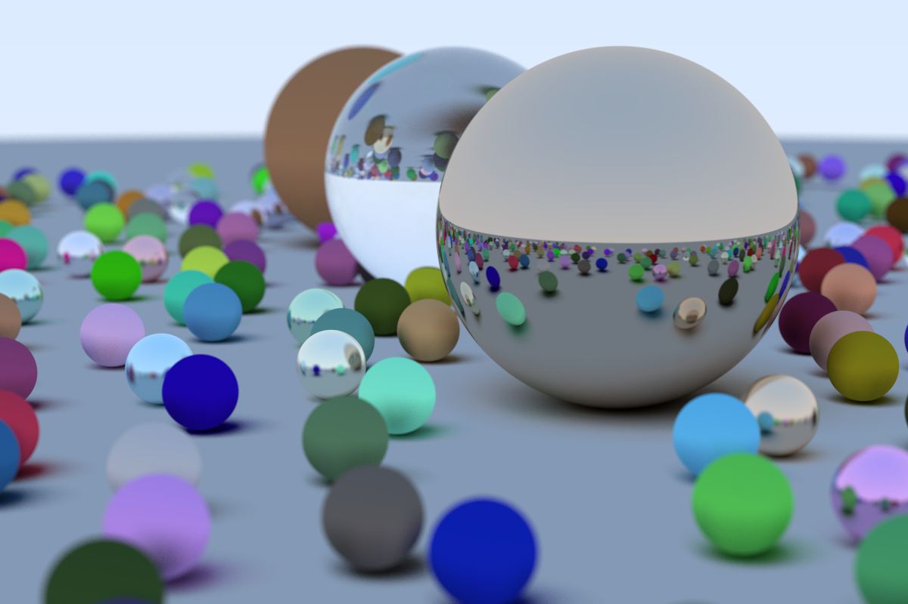

# Ray Tracing in One Weekend  

Projeto para calcular a trajetória de raios de luz através de objetos. Desenvolvido com base no conteúdo do livro [_Ray Tracing in One Weekend_](https://raytracing.github.io/books/RayTracingInOneWeekend.html)

