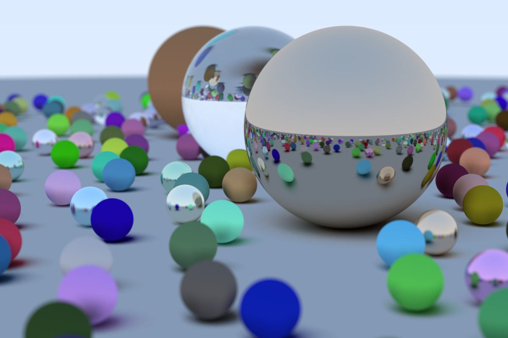
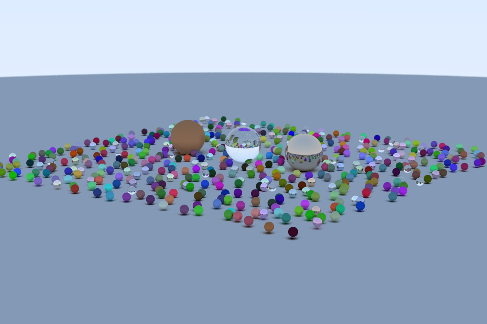
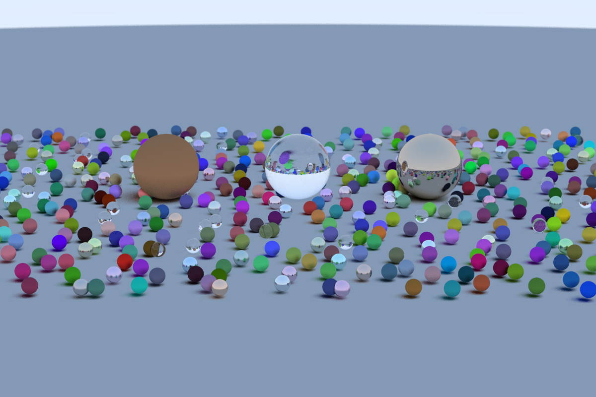

# Ray Tracing in One Weekend  

Project to calculate the trajectory of light rays through objects and generate images. Made following the book [_Ray Tracing in One Weekend_](https://raytracing.github.io/books/RayTracingInOneWeekend.html)

  
  
  

# update
Due to the time taken to computate one single image in a single thread changes were made to the algorithm.  

## dependencies
* **image**: to save the generated values as a png image  
* **rand**: to generate random values  
* **rayon**: for paralellism  

## benchmarks
benchmarks to generate 400x266 and 1200x800 images.
```bash
# before
400x266 = 89,40s user 0,51s system 99% cpu 1:29,95 total
1200x800 = 842,12s user 8,19s system 100% cpu 14:09,97 total

# after
## using threads
400x266 = 164,94s user 1,34s system 615% cpu 27,018 total
1200x800 = 1464,60s user 15,60s system 654% cpu 3:46,13 total

## using rayon
400x266 = 162,81s user 0,24s system 739% cpu 22,046 total
1200x800 = 1535,13s user 1,80s system 757% cpu 3:22,94 total
```
Rust Rayon had a better usage of the CPU and thus giving a better time than using Rust native threads.

## TODO
- [x] multi-threading  
- [x] save images as png  
- [ ] implement CLI options  
- [ ] update to version 4 of book  
- [ ] implement GPU processing  
